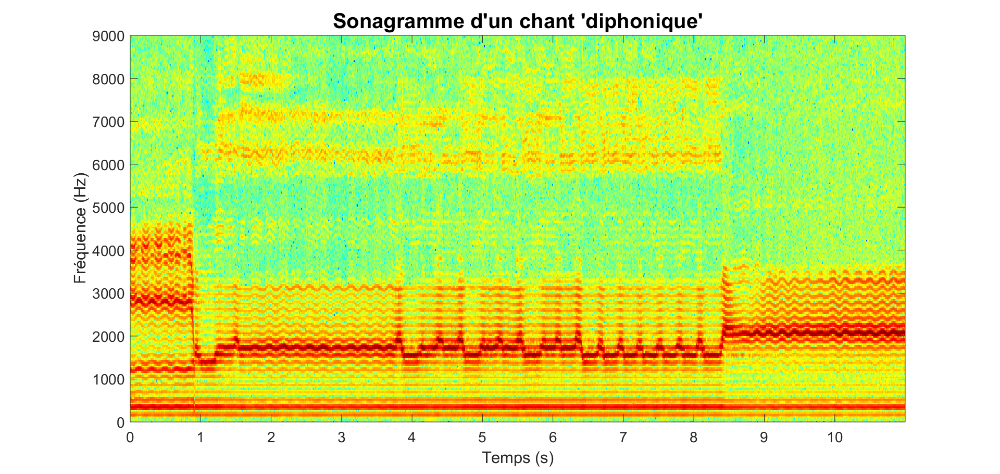
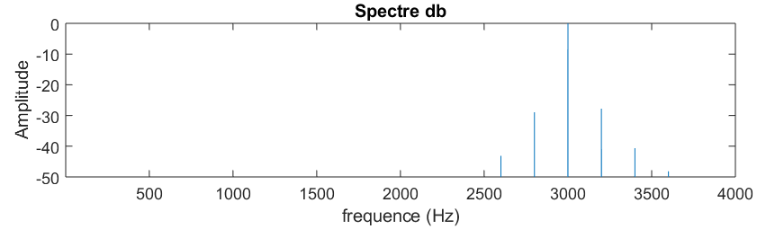
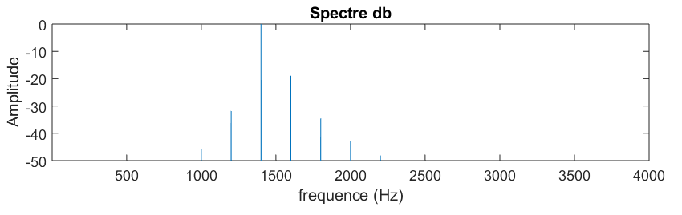
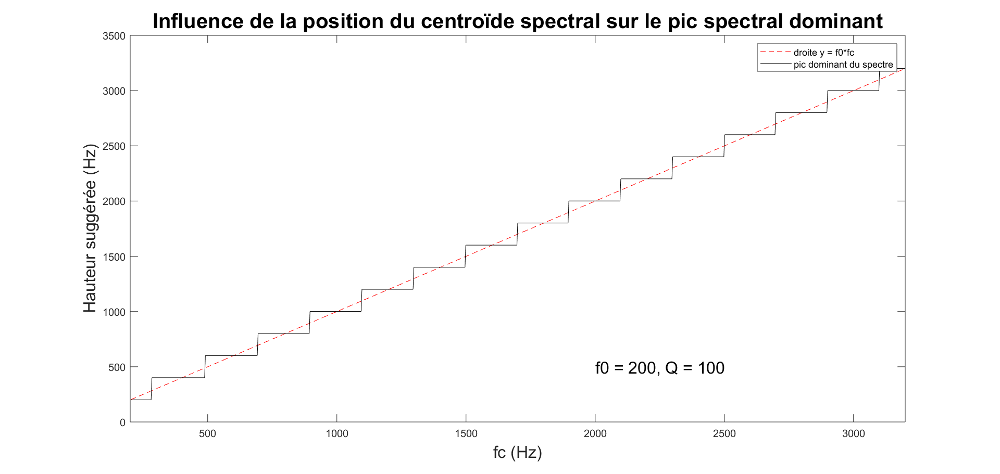
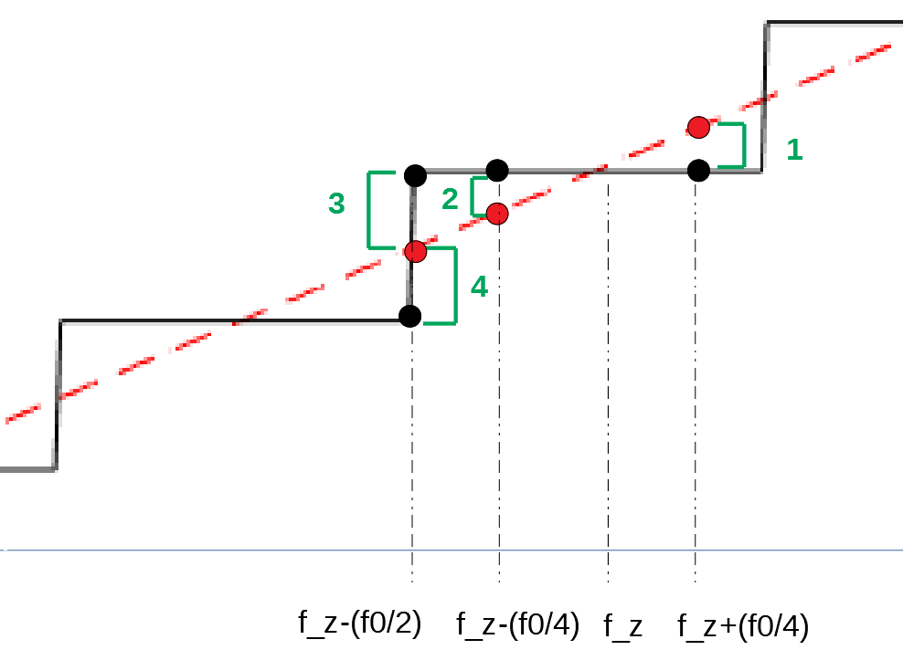
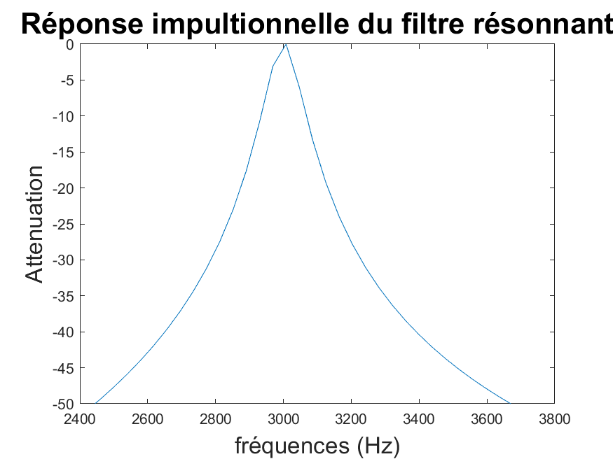
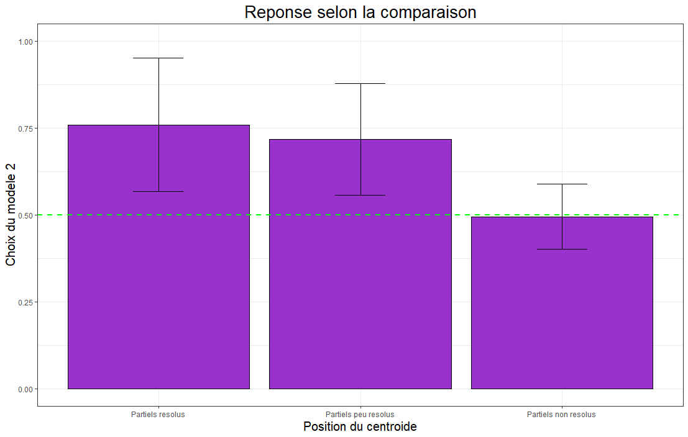

# PCBS-spectral_pitch_perception

#### Final project for PCBS class
#### (on the same topic as an internship at the LSP, ENS)
##### [web page version here](https://adker.github.io/PCBS-spectral_pitch_perception/)
#### *Adrien Kerebel*
##### *experiment designed with the help of A. de Cheveigné and J. Graves*

## Subject: auditory perception (pitch perception)

The aim of the project is to decide between two potential predictive models of spectral pitch perception (like in overtone singing).

## Background information
#### Overtone singing

Overtone singing (aka throat singing or Khoomei) is a set of traditional singing styles and techniques that originated from central Asia.

In these styles, a single singer produces two pitches at the same time: typically, one low steady note and a high whistle made of the harmonics of the low tone.

A commonly accepted explanation of the technique is that the singer produces a spectrally rich sound from which specific harmonics are amplified by resonating in his nasal and vocal cavities (like in a Helmholtz resonator).

An example of overtone singing in the Sygyt style can be found [here](https://www.youtube.com/watch?v=vo34v7QQ254) or [on this wave file](throat_singing_example.wav)
We can follow the overtone melody from 00:54 to 01:04 of the video on this spectrogram (see below, you should focus on the 1000Hz-3000Hz frequency range).

We can notice that there are two kinds of pitches here: a **virtual pitch** corresponding to the fundamental frequency of the sound and **spectral pitches** elicited by maxima of energy in the spectrum.  

#### Research question

I am interested here in how to predict the perceived spectral pitch from the physical properties of the sound.

For doing that, I imagined two very simple models of spectral pitch perception.

According to the first model, the spectral pitch corresponds to the center of the **spectral envelope** of the sound (an imaginary line that determines the height of each harmonic partial in the spectrum).
For example, for this sound it would be 3000Hz:

According to the second model, the spectral pitch corresponds to the frequency of the harmonic partial that has the most energy (the higher bar in the spectrum).
For example, for this sound it would be 1400Hz:

It is worth noting that these two models predict the same pitch when the spectral envelope is centered on a harmonic of the sound (like in overtone singing). To decide between them we have to use sounds for which it is not the case.

The predictions of the two models are summed up in the following figure:

## Description of the experiment

The experiment is designed to decide between the two curves on the figure above in three "*harmonic zones*": around the 7th harmonic (where partials are resolved), around the 11th harmonic (where partials are less resolved), and around the 13th harmonic (where partials are not resolved).

#### Hypothesis

Our hypothesis is that the perceived spectral pitch will follow the strongest harmonic partial model for low spectral pitches (where partials are resolved) and that it will follow the position of the spectral envelope for higher spectral pitches (unresolved partials).

#### Task

In every trial, we try to see which of the two models best fits the spectral pitch elicited by a given complex sound.

Participants are presented with two pairs of sound consisting of one sine wave and a complex tone (with the same complex tone on each pair). They are asked to choose which of the two pairs consist of sounds that "match the best together". Every time, the two sine waves correspond to the prediction of the two models.

We assume that the sine wave whose frequency is the closest to the perceived spectral pitch of the complex sound will be perceived to "match the best" with this sound.

At the end of every trial, the subject is asked to rate how confident he is about he answer on a three-degree scale.

Four types of comparisons are made, corresponding to four positions of the spectral envelope on a "harmonic zone". For a harmonic zone centered on f_z, the comparisons made are as follows:

#### Procedure

To make sure that participants can discriminate frequencies, I included a test phase at the beginning of the experiment, where the subject has to compare pairs of pure tones.
All the potential spectral pitches that are proposed in the "real" task are tested for discrimination in the test phase.

Then there is a brief familiarisation phase on the format of the real task (but with different f0s).

Then the task begins.

The experiment code is available [here](experiment_spectral_pitch_final.py). Note that the stimuli have to be generated before running the experiment, see procedure below.

#### Stimuli

Complex sounds stimuli are synthetic sounds produced as follows:
- we generate an impulsions series (with chosen fundamental frequency f0)

- we filter it in a resonating filter (with chosen resonance frequency fr and quality factor Q)

- we obtain a sound with two pitches

This was done with a [Matlab script](generation_of_stimuli_final.m) using [this filter](nt_filter_peak.m).

## Results

A detailed analysis of the results of the experiment is available on the attached R markdown document.

Briefly, the second model (strongest partial in the spectrum) seems to be preferred on the *resolved partials zones* (as expected).

Interestingly, none of the models is strongly preferred on the non-resolved partials zone.    

